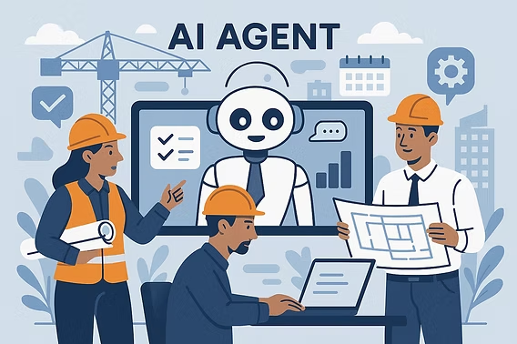

## Overview

At MetaBizDesign, I design and develop LLM-based domain agents for workflow automation in civil engineering and construction. My responsibilities include agent architecture, tool integration, and the memory and context mechanisms needed to carry out tasks across multiple steps.

This work began in June 2025 and is ongoing. The description below summarizes my engineering contributions at a general level.

## Technical contributions

- **Multi-Agent Orchestration:** Designed and implemented agent workflows using LangChain and the OpenAI Agents SDK, connecting task delegation, tool calling, result validation, and follow-up processing.
- **Memory and context management:** Implemented agent memory, conversation-history management, and task-relevant context selection to maintain continuity across agent interactions.
- **Domain knowledge representation:** Modeled concepts and relationships through a domain ontology and implemented validation rules to support consistent information handling.
- **Execution reliability:** Added execution-time, token-usage, and error tracking, together with call limits, retries, and recovery handling for interrupted or unsuccessful runs.

## Testing and refinement

Tested the agents with domain experts and used their feedback and observed failure cases to refine tool behavior, context handling, and execution flow. This work focused on turning domain requirements into agent behavior that could be tested and improved through repeated use.
