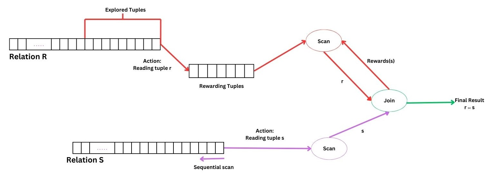

---

##### Download

+ [Paper (Under Review)]()
+ [Code](https://github.com/kapshaul/Join-Game)

---

##### Abstract

It is crucial to provide real-time performance in many applications, such as interactive and exploratory data analysis.  It is challenging to deliver such results over large datasets for relational operators over multiple relations, such as join. 
Join algorithms usually spend a long time scanning and attempting to join parts of relations that may not generate any result. Current solutions usually require lengthy and frequent preprocessing, which is resource-intensive and may not be possible to do in many settings. Also, they often support restricted types of joins. We outline a novel approach for achieving efficient join processing in which join operators learn during query execution the portions of their inputs that are most likely to satisfy their join predicates.  We improve this approach by overlapping learning and sharing information across join operators to speed up learning and query execution.  Our empirical studies using standard benchmarks and real-world datasets indicate that this approach outperforms similar methods considerably.

---

##### Figure 1: Example of Learning Query Processing Strategy Online

---

##### Citation

This paper is currently under review for PVLDB (to be presented at VLDB 2025).

---

##### Related material

+ [Prior study](https://research.engr.oregonstate.edu/idea/sites/research.engr.oregonstate.edu.idea/files/aidm-main.pdf)
