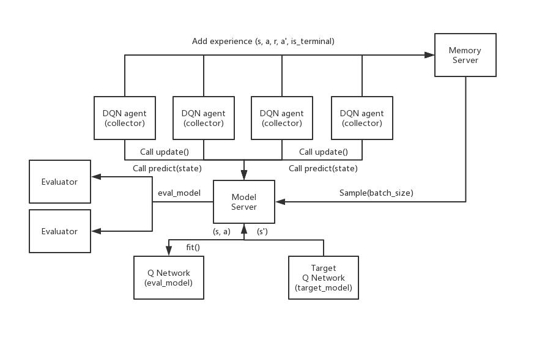

---

##### Download

+ [Code](https://github.com/kapshaul/Distributed.Multi-Agents.RL)

---

##### Abstract

The goal of this project is to implement and experiment with both single-core and distributed versions of the deep reinforcement learning algorithm Deep Q Networks (DQN).
In particular, DQN will be run in the classic RL benchmark Cart-Pole and abblation experiments will be run to observe the impact of the different DQN components.

---

##### DQN Overview
DQN is simply the standard table-based Q-learning algorithm but with three extensions:
1) Use of function approximation via a neural network instead of a Q-table.
2) Use of experience replay.
3) Use of a target network.

Extension (1) allows for scaling to problems with enormous state spaces, such as when the states correspond to images or sequences of images. Extensions (2) and (3) are claimed to improve the robustness and effectiveness of DQN compared.

(2) adjusts Q-learning so that updates are not just performed on individual experiences as they arrive. But rather, experiences are stored in a memory buffer and updates are performed by sampling random mini-batches of experience tuples from the memory buffer and updating the network based on the mini-batch. This allows for reuse of experience as well as helping to reduce correlation between successive updates, which is claimed to be beneficial.

(3) adjusts the way that target values are computed for the Q-learning updates. Let $Q_{\\theta}(s,a)$ be the function approximation network with parameters $\\theta$ for representing the Q-function. Given an experience tuple $(s, a, r, s')$ the origional Q-learning algorithm updates the parameters so that $Q_{\\theta}(s,a)$ moves closer to the target value:

$$
r + \\beta \\max_a' Q_{\\theta}(s',a')
$$

Rather, DQN stores two function approximation networks. The first is the update network with parameters $\\theta$, which is the network that is continually updated during learning. The second is a target network with parameters $\\theta'$. Given the same experience tuple, DQN will update the parameters $\\theta$ so that $Q_{\\theta}(s,a)$ moves toward a target value based on the target network:

$$
r + \\beta \\max_a' Q_{\\theta'}(s',a')
$$

Periodically the target network is updated with the most recent parameters $\\theta' \\leftarrow \\theta$. This use of a target network is claimed to stabilize learning.

---

##### Distributed DQN agent

The idea is to speedup learning by creating actors to collect data and a model server to update the neural network model.
- Collector: There is a simulator inside each collector. Their job is to collect exprience from the simulator, and send them to the memory server. They follow the explore_or_exploit policy, getting greedy action from model server. Also, call update function of model server to update the model.
- Evaluator: There is a simulator inside the evaluator. It is called by the the Model Server, taking eval_model from it, and test its performance.
- Model Server: Stores the evalation and target networks. It Takes experiences from Memory Server and updates the Q-network, also replacing target Q-network periodically. It also interfaces to the evaluator periodically.
- Memory Server: It is used to store/sample experience relays.

An image of this architecture is below.



For this part, using ```custom_cartpole.py``` as an enviroment. This version of cartpole is slower, which allows for the benefits of distributed experience collection to be observed. In particular, the time to generate an experience tuple needs to be non-trivial compared to the time needed to do a neural network model update.

---

##### Installation

1. Clone the repository:

    ```bash
    git clone https://github.com/kapshaul/Distributed.Multi-Agents.RL.git
    cd Distributed.Multi-Agents.RL/Distributed DQN
    ```

2. Install the required Python packages:

    ```
    pip install -r requirements.txt
    ```

---

##### Implementation

1. Set Up the Environment

   The code is designed to work with a custom CartPole environment. Make sure that the `custom_cartpole.py` and the necessary model and memory files (`dqn_model.py`, `memory_remote.py`) are properly configured and located in the repository.

2. Execute the Distributed DQN Python Script

   To start training the Distributed DQN on the CartPole environment, run `python distributed_dqn.py`.