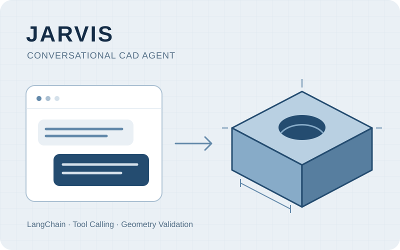

## Overview

JARVIS is a web application for creating and modifying CAD models through conversation. It connects a LangChain agent to modeling tools so that a user can describe a change, inspect the resulting geometry in a 3D view, and continue refining the model.

The project covers the agent workflow, CAD tool integration, validation, revision history, and the web interface. Development began in March 2026 and is ongoing.

## Technical contributions

- **Agent and tool integration:** Implemented a LangChain agent with structured tool inputs and outputs for inspecting and modifying CAD models. Connected conversational requests to executable modeling operations.
- **Geometry validation:** Integrated geometry and dimensional checks, including regeneration from the saved model definition. Validation results help distinguish a generated candidate from a verified model.
- **State and revision management:** Preserved model revisions and conversation context so that subsequent requests can refer to an earlier result. Kept candidate changes separate from the accepted model state.
- **Interactive 3D interface:** Implemented web-based visualization and selection of model features to connect conversational requests with the geometry being edited.

## Implementation

Python manages the agent, model state, validation, and application API. Replicad and OpenCascade perform geometry operations in an isolated server-side Node.js process. The browser uses Three.js to display the resulting mesh and support interaction with the model.

The workflow connects **conversation → tool execution → validation → 3D review**, with revision history available for subsequent edits. The illustration above is a concept diagram, rather than an application screenshot.

## Current scope

The implementation supports a defined set of modeling operations and validation checks. It is under active development, with a focus on connecting agent decisions to inspectable CAD results.
