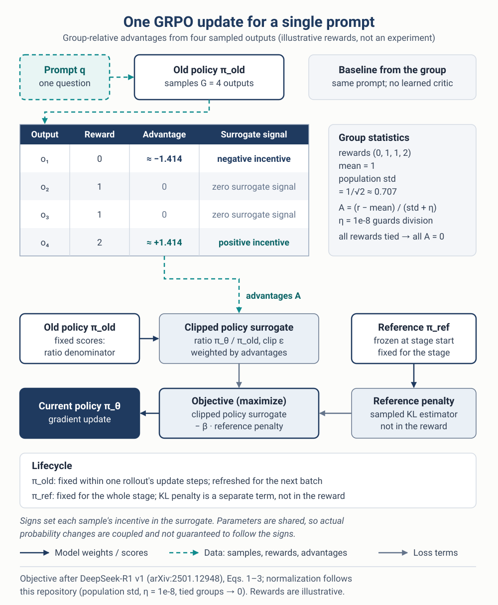
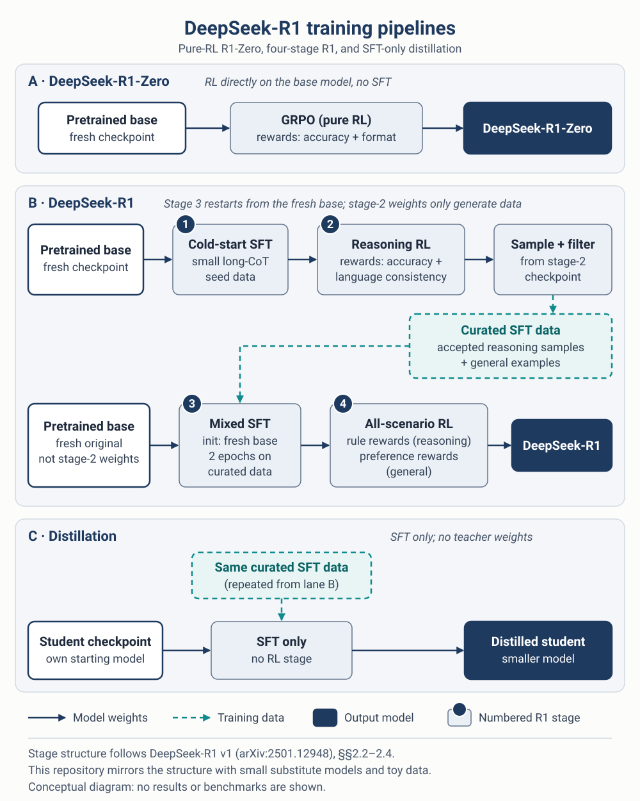

---

##### Download

+ [Code](https://github.com/kapshaul/llm-finetuning-grpo)
+ [Paper v1](https://arxiv.org/html/2501.12948v1)
+ [Method notes](https://github.com/kapshaul/llm-finetuning-grpo/blob/main/docs/method.md)

---

##### Research question

DeepSeek-R1 reports that reinforcement learning with simple, verifiable rewards can strengthen step-by-step reasoning in a language model. This project asks a narrower, practical question: what exactly has to be implemented to reproduce the *structure* of that recipe, and which details are stated in the paper versus left to the implementer?

The repository answers this with a readable, pure-PyTorch implementation of group relative policy optimization (GRPO) and the three training pipelines described in [DeepSeek-R1 v1](https://arxiv.org/html/2501.12948v1): R1-Zero, the four-stage R1 pipeline, and distillation. It is a study implementation. It mirrors the stages with small models and toy data and does not reproduce DeepSeek-scale training or its results.

---

##### GRPO intuition

GRPO was introduced in [DeepSeekMath](https://arxiv.org/html/2402.03300v3). PPO-style methods usually learn a critic to estimate how good a response is. GRPO replaces that critic with a comparison inside a group. For one prompt $q$, the old policy samples $G$ completions, each completion receives a scalar reward, and each reward is compared with the others for the *same* prompt:

$$
A_i = \frac{r_i - \operatorname{mean}(r_1, \dots, r_G)}{\operatorname{std}(r_1, \dots, r_G) + \eta}
$$

This repository uses the population standard deviation and $\eta = 10^{-8}$. If every reward in a group is tied, every advantage is zero, so that group gives no surrogate signal. For rewards $(0, 1, 1, 2)$, the mean is 1, the standard deviation is $1/\sqrt{2}$, and the advantages are approximately $(-1.414, 0, 0, +1.414)$.

<figure>

<figcaption>One GRPO update for a single prompt. The rewards are illustrative, not experimental results.</figcaption>
</figure>

The advantages weight a clipped policy objective. The probability of a whole completion is the product of its token probabilities; its log-likelihood is the sum of the token log-probabilities. With the ratio between the current and old policies

$$
\rho_i = \frac{\pi_\theta(o_i \mid q)}{\pi_{\theta_\text{old}}(o_i \mid q)},
$$

each completion contributes a clipped term

$$
L_i = \min\!\big(\rho_i A_i,\ \operatorname{clip}(\rho_i, 1 - \varepsilon, 1 + \varepsilon)\, A_i\big),
$$

and the group objective, which is maximized, subtracts a penalty toward a reference model:

$$
\mathcal{J}(\theta) = \frac{1}{G} \sum_{i=1}^{G} \big(L_i - \beta K_i\big)
$$

$$
K_i = u_i - \log u_i - 1, \quad u_i = \frac{\pi_\text{ref}(o_i \mid q)}{\pi_\theta(o_i \mid q)}
$$

Several details matter in practice:

- **Old policy and reference.** Old-policy scores are fixed across the update steps for one rollout batch and refreshed for the next batch. The reference model is frozen for the whole RL stage. That is a choice made in this repository.
- **The penalty is not an exact KL.** $K_i$ is a sampled estimator. When completions are reused from the old policy, it acts as a penalty rather than an unbiased estimate of the exact KL divergence.
- **Clipping is not a hard trust region.** For a positive advantage it removes further surrogate incentive above $1 + \varepsilon$; for a negative advantage it does so below $1 - \varepsilon$. It does not strictly bound how far the policy moves.

By default, the code implements the sequence-level form of DeepSeek-R1 v1, Eqs. 1–3, literally. This is a reading of the paper, not a claim about DeepSeek's internal code. An optional token-level variant follows DeepSeekMath. It computes the ratio, clipping, and penalty for each token and averages them over each completion. The two forms are not algebraically equivalent.

---

##### Training pipeline

<figure>

<figcaption>The R1-Zero, R1, and distillation pipelines, following DeepSeek-R1 v1, Sections 2.2–2.4. The diagram is conceptual and shows no results.</figcaption>
</figure>

- **R1-Zero:** A pretrained base model is trained directly with GRPO, using accuracy and format rewards and no supervised fine-tuning.
- **R1, stage 1:** Cold-start SFT on a small set of long chain-of-thought examples.
- **R1, stage 2:** Reasoning-oriented RL with accuracy and language-consistency rewards.
- **R1, stage 3:** The stage-2 checkpoint generates samples, and only correct, readable outputs are kept. These are mixed with general data, and a *fresh copy of the original base model* is fine-tuned on the mixture for two epochs. The stage-2 weights generate data but are not carried forward.
- **R1, stage 4:** All-scenario RL. Reasoning prompts use rule-based rewards, while general prompts use preference callbacks. Helpfulness is judged on the final answer and harmlessness on the full response.
- **Distillation:** A student starts from its own selected checkpoint and receives SFT only on the curated data, with no RL stage. The paper's students include Llama-3.3-70B-Instruct, so a student is not necessarily an untouched pretrained base.

---

##### Implementation and evaluation

The implementation separates the algorithm from the model backend:

- **Backends.** An offline fixture pairs a byte-level tokenizer with a small, randomly initialized GRU, so training and checkpoint handling can be exercised on a CPU without model downloads. An optional backend loads a Hugging Face causal language model for full-weight training on a single device.
- **Rewards.** A rule-based answer verifier and language-consistency heuristics stand in for the rule rewards. Preference callbacks provide the general-domain signal. These are substitutes, not the original reward models or datasets.
- **Sampling.** RL rollouts use temperature 1 and top-p 1. That way, the recorded old log-probabilities describe the distribution the completions were actually sampled from.
- **Evaluation.** Following the paper's protocol, evaluation samples $k$ completions per question at temperature 0.6 and top-p 0.95. Pass@1 is the average correctness over those $k$ samples. Majority-vote consensus is reported separately, and "any sample correct" is never reported as pass@1.

---

##### Scope

This project is a study of the method, not a reproduction of DeepSeek-R1. It shows how the objective, the normalization, and the stage structure fit together in code, and it marks which implementation choices fill gaps in the published recipe. It reports no benchmark results and makes no claims about reasoning quality at scale. The [method notes](https://github.com/kapshaul/llm-finetuning-grpo/blob/main/docs/method.md) describe the method in more detail.

---

##### Reference

[1] DeepSeek-AI (2025). *DeepSeek-R1: Incentivizing Reasoning Capability in LLMs via Reinforcement Learning*. arXiv:2501.12948v1. [Paper v1](https://arxiv.org/html/2501.12948v1)

[2] Shao, Z., et al. (2024). *DeepSeekMath: Pushing the Limits of Mathematical Reasoning in Open Language Models*. arXiv:2402.03300v3. [DeepSeekMath](https://arxiv.org/html/2402.03300v3)
